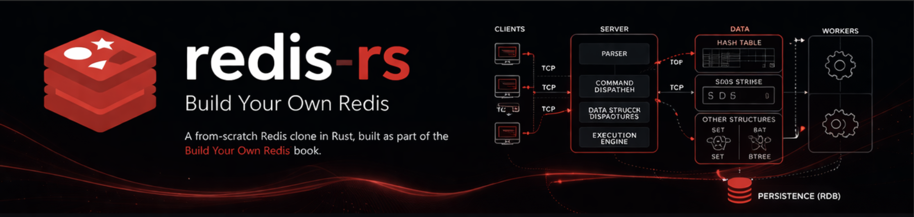

# Redis-like in Rust

## Overview
This is a learning project in Rust to build a minimal in-memory key-value store inspired by Redis.  
The goal is to practice systems programming concepts: UNSAFE RUST, manual memory management, data structures, TCP networking, and multithreading.  
Based on [Build Your Own Redis](https://build-your-own.org/redis/).

### The Foundation
This project isn't just a wrapper; it's a deep-dive into the internals of Redis:
- **Intrusive Structures:** We don't store data *in* the map; we embed the map *into* our data. This minimizes pointers and enhances cache locality.
- **Pointer-to-Pointer Lookup:** Our lookup returns an indirect pointer `**Node`, enabling clean $O(1)$ deletions without searching for the predecessor.
- **Non-blocking I/O:** Built on top of an event loop to handle concurrent connections efficiently.
- **Memory Control:** Full ownership of the memory lifecycle via manual allocations and explicit `drop_in_place` calls.

---
## Features

- TCP server with simple protocol (GET / SET / DEL)  
- Intrusive Hash Map for key storage  
- Set and B-Tree data structures  
- TTL (automatic key expiration)  
- Multithreaded request handling  

---
## Progress

- Completed up to **Chapter 7** of the BYOR guide  
- Implemented so far:
  - TCP server ✅
  - Protocol ✅  
  - Basic GET / SET commands ✅  

 
---
## TODO

- ✅ TCP server  
- ✅ Basic GET / SET / DEL 
- ⬜ Hash Map logic  
- ⬜ Key/value serialization
- ⬜ Improve DEL command
- ⬜ Improve Set operations  
- ⬜ Add B-Tree for ordered data  
- ⬜ Implement TTL (automatic key expiration)  
- ⬜ Add multithreading (worker pool / sharding)  
- ⬜ Write tests for each data structure  
- ⬜ Run mini-benchmarks (ops/sec, latency)  
- ⬜ Complete README with architecture and benchmark results  

---

## Project Structure (example)
src/                              
├─ main.rs # TCP server
//future
├─ hashtable.rs # Intrusive Hash Map                                                      
├─ btree.rs # B-Tree                              
├─ set.rs # Set                              
├─ ttl.rs # TTL mechanism                              
├─ threading.rs # Multithreading                              
└─ utils.rs # Helper functions                              

---

## Next Steps (3-4 weeks)

1. Start with implementing hashtables using Rust ( from C )
2. Finish core commands (ADD/SET/DEL) using more complex data structures                              
3. Add TTL and simple multithreading                                
4. Write tests and mini-benchmarks                                
5. Publish progress on LinkedIn/GitHub with architecture explanation                              
